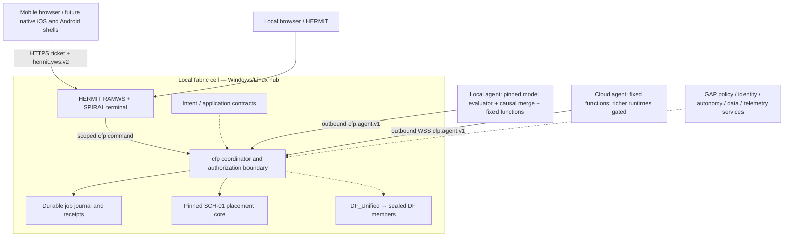
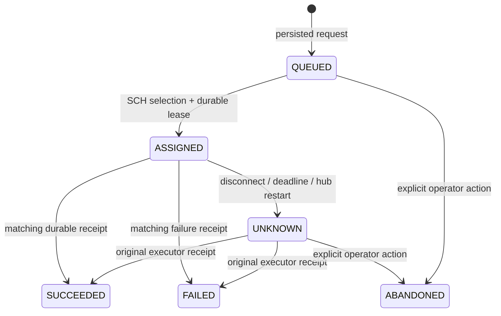

# Continuous Fabric Platform: architecture and source synthesis

**Decision date:** 2026-09-23  
**Selected profile:** Windows/Linux local hub, mobile/browser clients, outbound cloud agents  
**Reference implementation:** 0.4.1 (local-hub GO pass over 0.4.0); scoped CFP_LOCAL_HUB_GO; full G7 production_go remains false

## 1. Platform definition

The continuous fabric is one authenticated namespace for applications, capabilities, jobs, state references and execution receipts, presented through a virtual terminal. Physical placement remains explicit where it affects trust, availability, cost, energy or data residency.

The platform's unit of authority is a **fabric cell**, following the supplied UC32 Cubby architecture. A cell owns identity, state, policy, execution, experience and federation boundaries. DF_Fabric provides its bounded control/backplane role; DF_Unified binds its sealed compute members. The local hub is the first implementation of part of a cell's control boundary.

A WebSocket is a transport connection, not an identity, durable workspace, distributed memory bus or consensus mechanism. A user may reconnect from a phone to the same job namespace without reviving a lost terminal session.



Solid links describe the reference path. Dotted links describe specified integrations awaiting promotion. The local test used an outbound agent labelled cloud on this Windows host; it is not evidence of a real cloud deployment.

## 2. What replaces Kubernetes responsibilities

| Responsibility | Fabric mechanism | Source authority | Current delivery |
|---|---|---|---|
| Desired application state | Versioned intent and component graph, artifact/world/ABI pins | PLN-01/02, INV-10/11/64 | Target contract; not a Kubernetes manifest converter |
| Placement | Trust-derived isolation floor, capability filters, fresh reports, lease commit | SCH-01 with GAP-02/03/10/11/14 | Actual SCH-01 core used; richer advisors staged |
| Node lifecycle | Supervisor, signed capability report, compatible runtime registration | GAP-01/02/06/15 | Operator enrollment and liveness implemented; attestation staged |
| Runtime execution | Capability-specific adapters for Wasm, process, microVM, VM, unikernel and sealed row witnesses | PLN-04, INV-09–45/70–72, DF members | Four fixed trusted operations; runtime expansion gated |
| Service connection | Typed local/remote interfaces and capability providers | INV-20/21/48/61/65, PLN-03 | Terminal and agent protocols; distributed WIT RPC staged |
| Durable work | Idempotent requests, execution identity, receipts and explicit uncertainty | INV-53/57, GAP-04/05 | Single-hub durable job path; no exactly-once external effects |
| Security | Stable principals, scoped grants, signed policy and artifact provenance | PLN-07, GAP-06/07/13, INV-41/42/55 | Static token grants and source hashes; higher assurance staged |
| Day-two operations | Observability, OTA, rollback, capability recertification | GAP-08/09/15, INV-07/63 | Reference diagnostics and tests; production rollout staged |
| Kubernetes transition | Adapter into existing estates | INV-04/05/06/07/58/67 | Optional compatibility boundary, never the new authority |

Removing Kubernetes does not remove scheduling, reconciliation, identity, failure handling or lifecycle duties. This architecture assigns each duty to an explicit owner and admits only the implemented subset.

## 3. The seven planes

1. **PLN-01 intent:** desired outcome, latency class, budget, residency, availability and trust requirements. No caller may claim a stronger provenance class merely to obtain cheaper isolation.
2. **PLN-02 application:** component graph, WIT worlds, interface versions, artifact digest, portable representation and dependency closure.
3. **PLN-03 distributed runtime:** routing, capability providers, invocation, messaging, durable workflow and typed interface negotiation.
4. **PLN-04 execution:** node-local supervisor and adapter enforce the awarded tier, resource budget, artifact pin and execution identity.
5. **PLN-05 elasticity:** capacity intent and scaling decisions, constrained by identity, power, thermal and data policy; it cannot overwrite hard admission filters.
6. **PLN-06 data:** bulk movement, references, causal replication, durable journals, checkpoints and residency enforcement.
7. **PLN-07 security:** principals, device/agent trust, provenance, capability attenuation, secrets and signed policy.

SCH-01 owns final placement selection. GAP-03 supplies topology/fairness advice; its README explicitly excludes ownership of final placement. The coordinator owns durable placement commit and transport outcome accounting. The runtime owns isolation enforcement; a scheduler's tier label is not an isolation proof.

## 4. Package composition decisions

| Sources | Role and decision |
|---|---|
| _model | Reuse the pinned offline evaluation component. Its full repository-refinement entry expects an adjacent MODEL_CONFIG.json and mission/bootstrap.py installation that is absent here. No full reasoning-model training/refinement run is claimed. |
| BOTTLE_ROCKET 61K and 110K | Preserve independent VM packages and their evidence. The sealed DF member's pins choose its runtime; a larger corpus or version label does not authorize replacement. These are the supplied custom packages, not an assertion about AWS Bottlerocket. |
| DF_Small/Medium/Large/Xtra_Large | Heterogeneous execution members, not interchangeable images. DF gate F7 records incompatible image execution. Transfer verified row/component representations and lower against a matching local runtime. |
| DF_Fabric | Federation/runtime owner for the sealed members, including replica/pipeline/BSP witness paths. Its existing evidence is local classical emulation with NETWORK=deny. The new agent channel does not promote that sealed federation to WAN operation. |
| DF_Unified and v1.0.0 | Single binding/integrity/verification door. Retain U0–U7, member seals and overlay accounting. Do not copy unrelated revisions into the sealed member trees. |
| HERMIT RAMWS | Reuse the hosted runtime, virtual filesystem, terminal renderer, session supervision, byte-credit and bounded resource mechanics. Keep its LOCAL_VOLATILE promise. Add only a scoped command bridge. |
| iOS735 releases / LinearAndroid | Native experience and lifecycle contract inputs. iOS v0.2 documents structural translation, pending owner toolchain pins and incomplete controls. Browser access is the working mobile path; native compilation and background compute require separate gates. |
| UC32 | Normative cell/Cubby composition and state/authority boundary. Its source says production_go remains false; local conformance does not establish multi-host or strict VM isolation. |
| QVM alpha | An experimental runtime candidate behind explicit capability negotiation. No physical QPU, distributed quantum execution or arbitrary quantum hardware access is asserted. |
| RODEO | Build graph, incremental/reproducible build and packaging input. Its documented core covers 196/1,005 components; do not present the complete build ecosystem as implemented. |
| All GAP/INV/PLN/SCH packages | Keep individual identity, version, boundary and evidence records. The full package register and extracted PK contract identifiers are in catalog/. Duplicate-looking paths are retained until content/evidence equivalence is established. |

The new reference does not inherit the existing CFP 1.0 scaffold's hot path. That scaffold explicitly says its atoms were not imported. It is retained as background source only. Its timestamp-winner reconciliation is superseded here by the supplied GAP-05 causal frontier semantics.

## 5. Session, node and execution identities

Use separate identifiers:

- **principal:** durable user/service identity with tenant and capabilities; never inferred from socket address.
- **cell / node:** stable enrolled execution owner. The reference binds node ID, site, tenant and permitted operations in an operator-owned grant file.
- **session:** HERMIT's random connection-scoped session ID and server epoch. They confer no independent authority.
- **request key:** idempotency key scoped to tenant and submitting principal.
- **job ID / lease:** immutable execution request identity and a random assignment token.
- **artifact / world / ABI:** explicit content and compatibility identities for future runtime adapters.

An agent cannot grant itself extra operations or substitute a payload node/site for its enrolled identity. The reference reports enrollment as OPERATOR_ENROLLED_NOT_HARDWARE_ATTESTED. Production admission must replace this seam with GAP-06 attestation, GAP-07 artifact authority and GAP-13 verified policy decisions.

## 6. Two explicit WebSocket contracts

**Human terminal:** exact path /ws/terminal, protocol hermit.vws.v2. The supplied implementation uses JSON control messages and binary terminal byte frames, monotonically sequenced input/output, byte credits and volatile session epochs. Several inherited vws200 Markdown files still describe v1; the v2 codec, gateway code and tests are authoritative for this build.

**Execution channel:** exact path /ws/agent, protocol cfp.agent.v1. This is a new small JSON protocol for register/welcome/heartbeat/execute/receipt/receipt.ack. It uses HERMIT's framing implementation but is not falsely advertised as wire-compatible with hermit.vws.v2.

Both share one externally visible hub listener and identity/policy boundary. The worker's terminal-to-coordinator bridge is separately authenticated and accepted only over a local connection. Browser tokens use HERMIT's one-use, origin-bound ticket cookie; agent tokens are sent in the native client's Authorization header. No credential is put in a URL.

Remote transport requires TLS with normal certificate validation. The reference uses outbound agent connections; it does not implement STUN/TURN, peer NAT traversal, WAN quorum or public tunnel provisioning. GAP-12 remains the integration owner for those extensions.

Terminal traffic and bounded job envelopes are control traffic. Large models, snapshots, datasets and images belong on the INV-37/38 bulk path with content hashes and residency policy, not in a terminal stream.

## 7. Continuity and failure semantics

The reference job state machine is:



The hub persists assignment before sending it. The agent persists EXECUTING before running and a result before sending a receipt. The hub persists the receipt before acknowledging. Duplicate submissions and matching duplicate receipts are idempotent; receipt equivocation and foreign leases fail.

The hub never reassigns UNKNOWN jobs automatically. Reconnection can reconcile only the original assignment. A late receipt is acceptable because no replacement execution was issued. An executor that restarts with only EXECUTING evidence reports UNKNOWN and does not rerun. This trades availability for a truthful outcome and avoids an unsupported exactly-once claim.

A client reconnect creates a fresh terminal and retrieves durable job state. The terminal's in-memory files/history are not recovered. Disconnecting a terminal does not cancel a durable job.

**GAP-05 integration:** state.merge invokes the original core and returns concurrent siblings/quarantine explicitly. It is a pure merge preview, not a deployed multi-replica database. The supplied 4.3 production overlay has additional identity/WAL/counter code and its own remaining gaps; that overlay is catalogued but not replaced or promoted by this preview.

**Future offline authority:** GAP-04 signed autonomy leases must bound capabilities, duration, budget, data scope and permitted side effects. Local cells should continue only within existing authority. No partition can mint new global authority. Replication must preserve conflicts, fence owners and record causal discards.

## 8. Runtime and placement contracts

The reference trusts only installed fixed operations and supplies SCH-01 with provenance internal and tier process. It does not accept provenance or an isolation tier from a terminal command. A node has one active slot. An uncertain assignment keeps that slot reserved until reconciliation or operator abandonment.

The target workload envelope extends this with:

```json
{
  "schema": "CFP_INTENT/1",
  "requestKey": "application-defined-id",
  "artifact": {"sha256": "...", "world": "namespace:world@version", "abi": "explicit"},
  "constraints": {
    "tenant": "authenticated-context",
    "allowedSites": ["local", "cloud"],
    "requiredCapabilities": [],
    "isolationFloor": "policy-derived",
    "deadlineMs": 30000,
    "offlinePolicy": "signed-lease-reference"
  },
  "state": {"consistency": "explicit", "residency": ["local"], "checkpoint": null}
}
```

This envelope is a target specification, not an accepted API of the current four-operation runner. GAP-15 must qualify each world/ABI/runtime/architecture combination. Core Wasm, Component Model/WASI, custom LCTL/MSSL VMs, unikernels and microVMs are separate runtime families; no universal binary portability is assumed.

WASI 0.3 is an available versioned async component contract, but compatibility still requires runtime/toolchain pins and tests. INV-14–19 and INV-22 branches should be selected by qualified ABI, not silently mixed. See the [Bytecode Alliance release](https://bytecodealliance.org/articles/WASI-0.3) and [async contract documentation](https://component-model.bytecodealliance.org/design/async.html).

## 9. Mobile behavior

The first mobile role is a foreground browser control surface. Compute survives browser suspension because execution belongs to the local or cloud agent. Reopen, reauthenticate and inspect the job ID.

Native iOS/Android execution is a later optional provider: declare foreground/background entitlement, bounded lifetime, power/thermal class, accessible data and supported ABI. Never schedule a durable always-on service onto a phone based only on a live socket. Apple's [background strategy documentation](https://developer.apple.com/documentation/BackgroundTasks/choosing-background-strategies-for-your-app) and [continued processing guidance](https://developer.apple.com/documentation/BackgroundTasks/performing-long-running-tasks-on-ios-and-ipados) describe distinct, constrained background mechanisms; neither makes every app an unrestricted daemon.

## 10. Promotion sequence and acceptance criteria

| Gate | Required evidence | Current result |
|---|---|---|
| G0 Source identity | Every supplied package accounted for; selected sources hashed; no source mutation | Inventory complete; selected bindings checked |
| G1 Terminal bridge | Real HERMIT connection, command, authorization, input/output and reconnect | Local tests and browser smoke check |
| G2 Single-cell compute | Native source scheduler and evaluator, durable submission/receipt, quotas, negative cases | Reference tests pass |
| G3 Two physical hosts | Separate Windows/Linux machines over TLS; reconnect, kill/restart, stale ownership, revocation, packet impairment | Not executed |
| G4 Mobile acceptance | Real iOS Safari + Android Chrome; keyboard, rotation, suspension/resume, expired credential | Not executed on physical devices |
| G5 DF/runtime promotion | U0–U7 and native runtime evidence on this host; pins, artifact provenance, resource isolation | Not executed; existing donor evidence remains donor-scoped |
| G6 Continuous services | Real GAP-04/05/06/07/12/13/14/15 service adapters and contract tests; no reference fixture substituted for authority | Specified, not promoted |
| G7 Production | Independent review, owners, trust/key custody, backup restore, rolling upgrade, SLOs and failure drills | Full G7 NO_GO; local custody+backup+drills PASS → CFP_LOCAL_HUB_GO only |

A passing small reference suite does not change an upstream production gate or establish performance, security isolation, multi-host consensus or comprehensive certification. The next implementation milestone is G3/G4 on real devices, followed by one qualified execution adapter and its complete authority chain.

## 11. Current limits and engineering follow-through

The reference journal is a bounded, fsynced, hash-linked single-writer log. It detects corruption but is not encrypted, externally anchored or immune to malicious replacement/truncation of a valid suffix. Directory durability and disk-loss resilience require a production storage layer and qualification. Torn tails fail startup for offline operator recovery.

Agent result storage uses atomic file replacement and an exclusive process lock. It is bounded to 1,000 jobs per agent; hub retention is 1,000 jobs and 32 MiB journal. This is explicit admission refusal, not automatic eviction of idempotency records. Retention migration/archiving must be designed before sustained production traffic.

Token files and fixed operations suit a private operator-controlled reference. Hardware-rooted trust, signed policy distribution, secrets brokering, workload sandboxing, weighted fairness, reliable telemetry, checkpoint migration and replicated authority remain separate integration work. Source package names containing production, operational or missing-components-applied are not proof that these cross-package paths have passed.

## 12. Traceability

- catalog/sources.json: package identity, document path, SHA-256, extracted contracts and boundary excerpts.
- catalog/INTEGRATION_MATRIX.md: every package and its assigned plane/status.
- catalog/bindings.json: exact files used by the Python source adapters.
- catalog/hermit-provenance.json: supplied and derived HERMIT file hashes.
- docs/VALIDATION.md: evidence from this build, distinct from inherited claims.
- docs/PROTOCOL.md: runnable reference contracts and semantics.

Primary local findings come from _model/reasoning_center/README.md, _model/repository_refinement.py, HERMIT gateway/worker/protocol code, DF_Unified README_START_HERE.md, DF_Fabric README_START_HERE.md, UC32 README_START_HERE.md, iOS735 v0.2 README.md, SCH-01 engine.py and README.md, GAP-03 README.md, GAP-04 README.md, GAP-05 model.py/README.md/PRODUCTION.md, GAP-13 README.md and RODEO README.md. Their full relative source paths and metadata hashes are retained in the catalogue.

